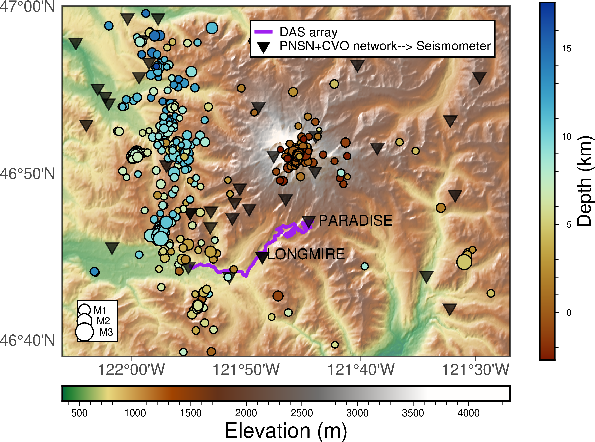

# VElgueta-2025

This repository contains the materials and figures from my DAS research project.

## About

This project presents earthquake data recorded with Distributed Acoustic Sensing (DAS) at Mount Rainier, WA, as part of my PhD research at the University of Washington. The repository contains figures, event files, and data summaries used in the manuscript *Distributed Acoustic Sensing Records of Earthquakes and Surface Processes at Mount Rainier Volcano* (2025).

## Highlights

- 🌋 Seismic monitoring using dark fiber near Mount Rainier  
- 📊 Event detection with template matching and cross-correlation  
- 📁 Publicly available data and waveform plots  

## Repository Structure
csv/ # csv require to do remake some figures
notebooks/ # Processed data or summaries to produce the figures presented on the paper
template-matching/ # Python scripts to run template matching and create the template, all at once
banner.png # Repository banner image
README.md # This file

## Citation

If you use this repository or data, please cite:
Gaete-Elgueta, V. et al. (2025). Distributed Acoustic Sensing Records of Earthquakes and Surface Processes at Mount Rainier Volcano. University of Washington Research Repository. [DOI: coming soon]

## DATA
The data is available here: 
https://dasway.ess.washington.edu/mora/index.html